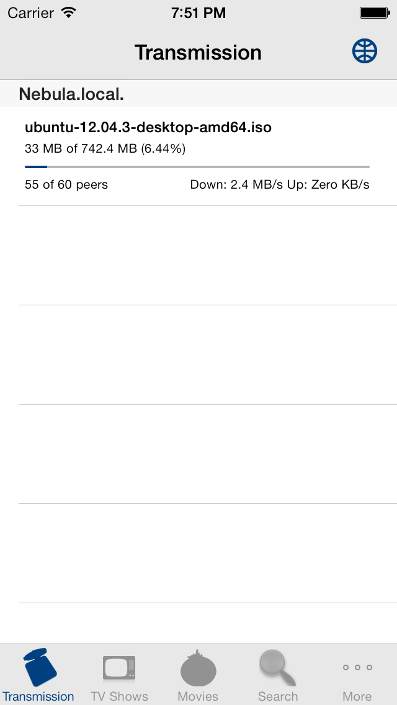
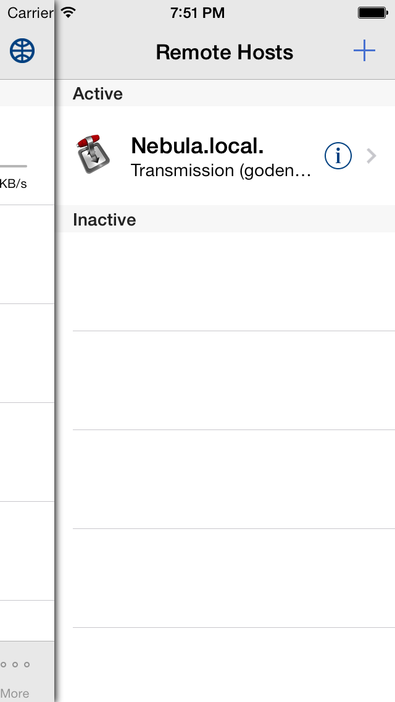
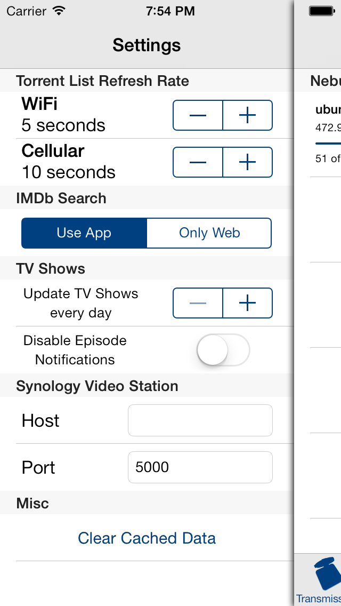
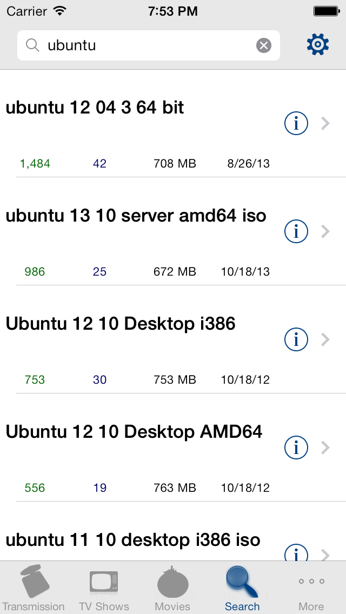
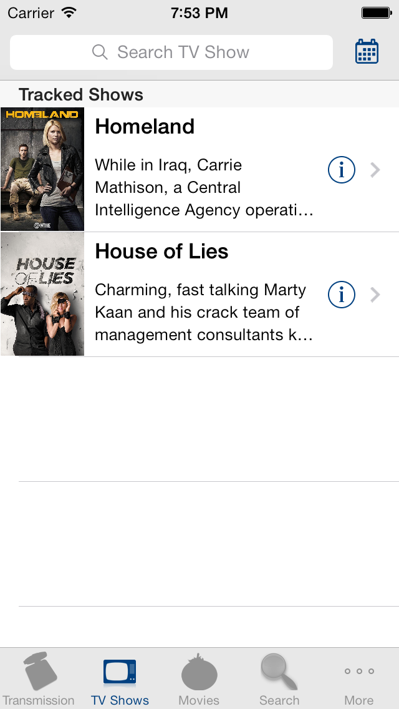
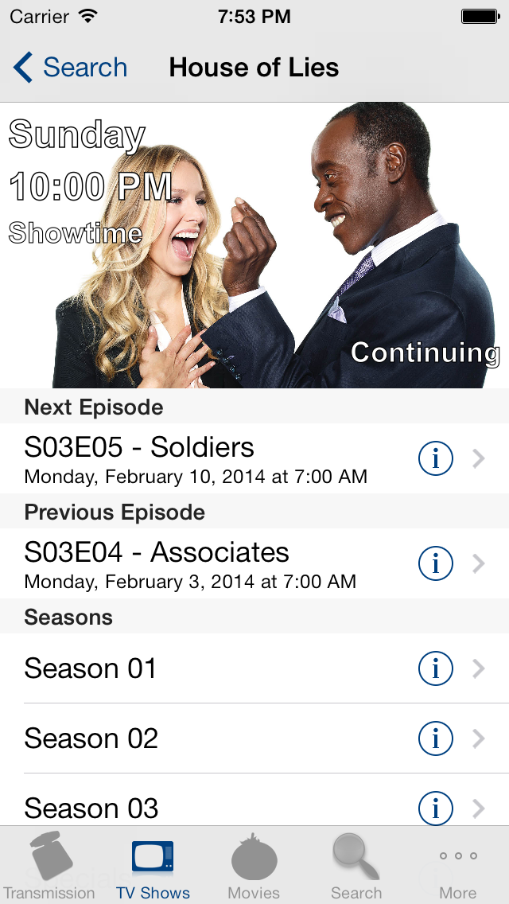
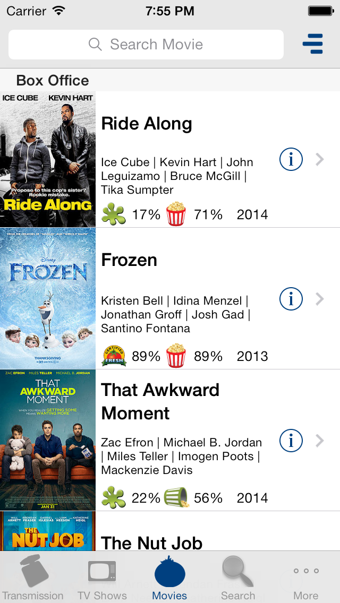
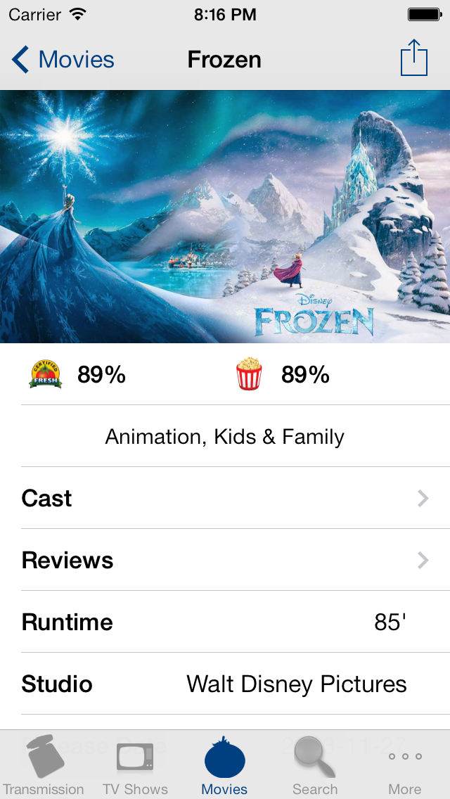
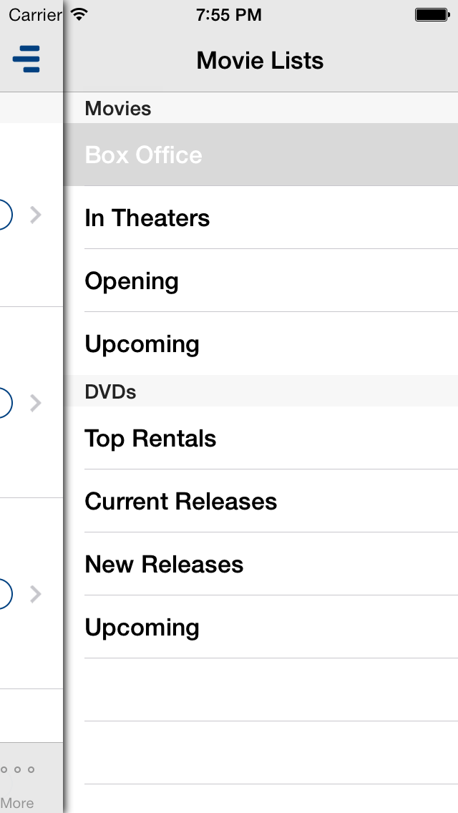

Turbo
=====

Turbo is an iOS remote client for [Transmission](http://www.transmissionbt.com).

Turbo allows to:

* Monitor current downloads.
* Easily search and add new torrents.
* Track TV Shows.
* Discover the latest movies.

API Keys
========
Turbo uses 3 API keys, to use all the functionalities, they need to be set in the API_KEYS.h file.

The keys are for:

* [Rotten Tometoes](http://developer.rottentomatoes.com)
* [The Movie DB](http://www.themoviedb.org/documentation/api)
* [The TV DB](http://thetvdb.com/?tab=apiregister)

Screenshots
===========

